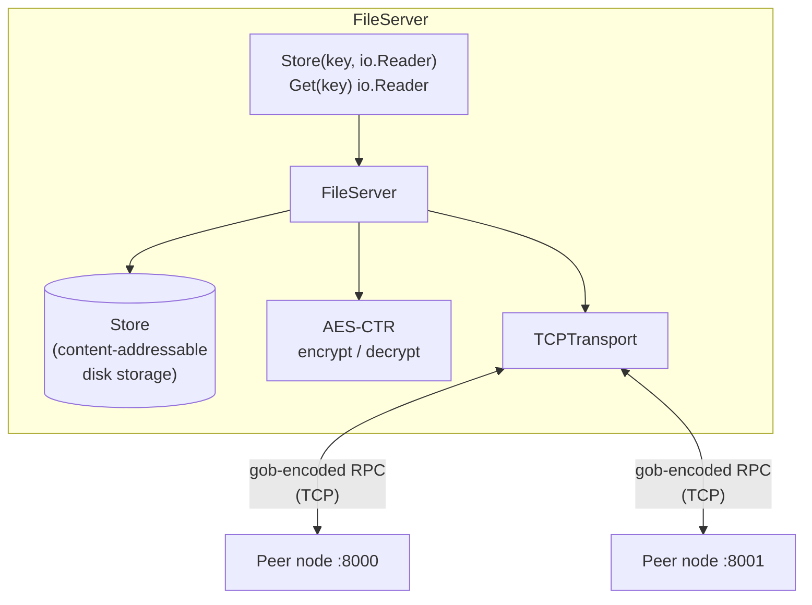
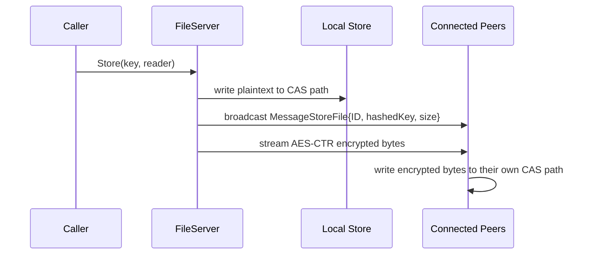
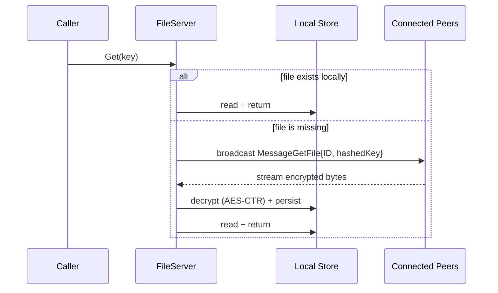
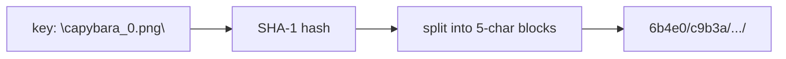

# capyfs

A peer-to-peer, encrypted, content-addressable distributed file storage system written in Go.

Every node runs its own TCP server, keeps its own on-disk content-addressable store, and can fetch a file it doesn't have from any peer in the network on demand. Files are encrypted with AES-CTR before they ever hit the wire or the disk.

## Features

- **Peer-to-peer networking** — nodes dial and accept raw TCP connections and exchange `gob`-encoded messages over a pluggable `Transport` interface.
- **Content-addressable storage (CAS)** — keys are SHA-1 hashed and split into nested directories, so files are stored and looked up by content hash rather than a flat filename.
- **Transparent encryption** — every file is encrypted with AES-CTR using a random per-file IV before being streamed to disk or to a peer, and decrypted transparently on read.
- **Broadcast + on-demand fetch** — writing a file broadcasts metadata to all connected peers and streams the encrypted bytes to them; a `Get` for a missing key asks the network for it.
- **Streaming I/O** — reads and writes work against `io.Reader`/`io.Writer`, so files are streamed rather than buffered whole in memory.

## Architecture



Each node wires together three independent pieces in `NewFileServer`:

| Component | File | Responsibility |
|---|---|---|
| `FileServer` | `server.go` | Orchestrates store/get requests, peer bookkeeping, and message broadcast/handling |
| `Store` | `store.go` | Maps a key to a CAS path under `<StorageRoot>/<NodeID>/...` and streams bytes to/from disk |
| `p2p.Transport` (`TCPTransport`) | `p2p/tcp_transport.go` | Dials/accepts TCP connections, runs the handshake, and decodes incoming `RPC`s |
| `crypto.go` | `crypto.go` | AES-CTR stream encryption/decryption with a random IV prepended to the ciphertext |

## How a `Store` works



## How a `Get` works



## Content-addressable path layout

`CASPathTransformFunc` (`store.go`) turns a key into a nested directory path so files are spread across the filesystem by their content hash instead of piling into one flat directory:



```
capyfs
└── <listenAddr>_network/       # StorageRoot
    └── <nodeID>/                # per-node namespace
        └── 6b4e0/c9b3a/.../      # CAS path derived from SHA-1(key)
            └── <full sha1 hex>   # the encrypted file contents
```

## Getting started

Requires Go 1.24+.

```bash
# build the binary to bin/fs
make build

# build and run
make run

# run the test suite
make test
```

`main.go` spins up a small local demo network of three nodes (`:8000`, `:8001`, `:8002`), has the third node bootstrap against the other two, then repeatedly stores, deletes locally, and re-fetches a file over the network to demonstrate the full store/broadcast/get cycle.

## Project layout

```
.
├── main.go            # demo wiring: builds nodes and drives the store/get cycle
├── server.go           # FileServer: peer management, broadcast, message handling
├── store.go             # Store: CAS path transform + streaming disk I/O
├── crypto.go             # AES-CTR stream encryption helpers, key/ID generation
└── p2p/
    ├── transport.go       # Transport / Peer interfaces
    ├── tcp_transport.go    # TCP implementation of Transport
    ├── message.go           # RPC envelope
    ├── encoding.go            # Decoder implementations (gob / raw peek-based)
    └── handshake.go            # pluggable handshake hook
```
